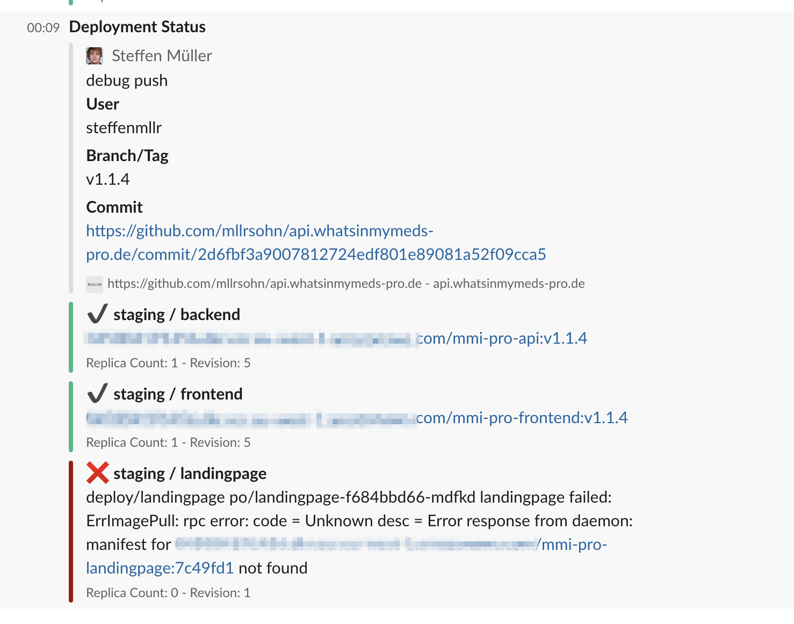

# validate-kubernetes-deployment 

> Validates kubernetes deployments and (optional) sends message to slack, exits with a non-zero status code if the deployment is not valid

### Github Action
```hcl
action "Validate K8s Deployment" {
  uses = "steffenmllr/validate-kubernetes-deployment@master"
  secrets = ["SLACK_HOOK_URL"]
  env = {
    KUBECONFIG  = "/path/to/KUBECONFIG/within/workspace",
    NAMESPACE   = "staging",
    DEPLOYMENTS = "backend,frontend"
  }
}

```

### Docker Usage
```bash
docker run -it \
-v path/to/kubeconfig.conf:/kubeconfig.conf \
-e KUBECONFIG=/kubeconfig.conf \
-e NAME="steffenmllr/validate-kubernetes-deployment v1.1.10" \
-e SLACK_HOOK_URL="https://hooks.slack.com/services/XXXX" \
-e NAMESPACE=staging \
-e DEPLOYMENTS=backend,frontend \
steffenmllr/validate-kubernetes-deployment:latest
```

### Local Usage

```bash
make setup
make

NAME="steffenmllr/validate-kubernetes-deployment v1.1.10" \
SLACK_HOOK_URL="https://hooks.slack.com/services/XXXX" \
NAMESPACE=staging \
DEPLOYMENTS=backend,frontend \
./validate

```

### Preview

